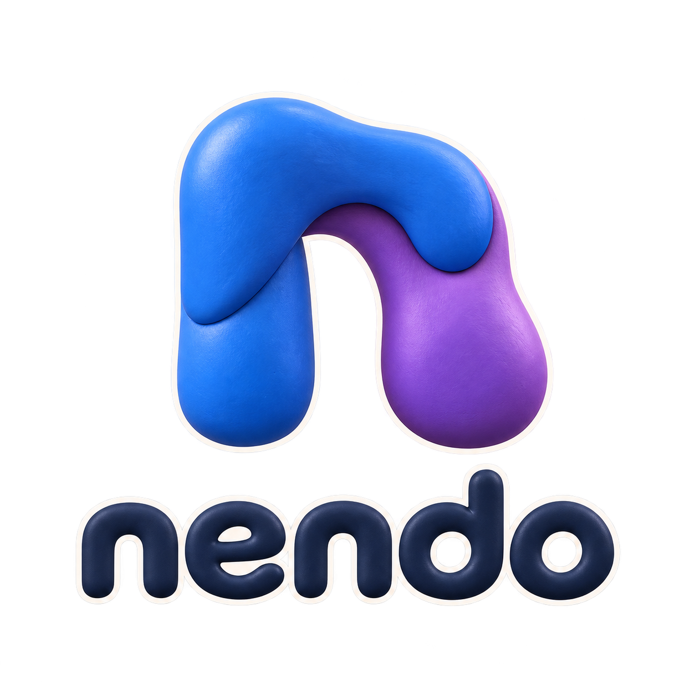
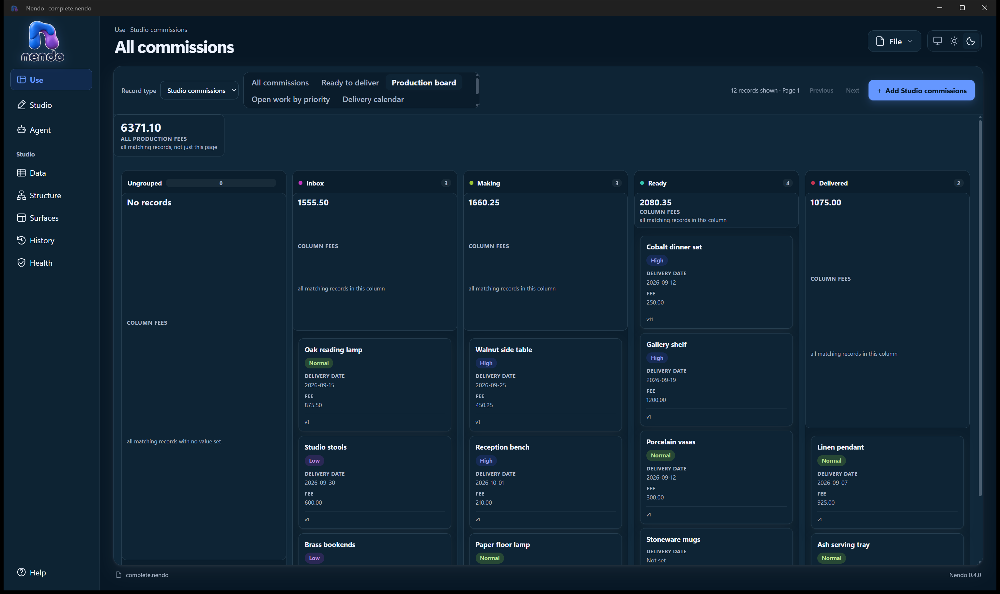

<p align="center">
  
</p>

# Nendo

**Malleable software in a single file.** One portable SQLite file starts empty
and is shaped — by people and by coding agents — into a working application:
schema, data, forms, boards, record pages and revision history. No generated
project. No build step. No regeneration when you want a change.

*Nendo* (粘土) is Japanese for clay.

> **Experimental.** Nendo is a research prototype exploring whether malleable
> software works, not a product. It runs as an unsigned per-user Windows x64
> install. Read [State](#state) before you rely on anything here.

**[thomasrohde.github.io/nendo](https://thomasrohde.github.io/nendo/)** — the
concept, how it works, how to use it, the honest status, and this repository's
documentation rendered as a site.

<p align="center">
  
</p>

<p align="center"><sub>A board an agent authored over MCP, in the running host.
Captured from the 2026-09-12 review build (0.16.0 is current), with the rest of
that review in <a href="docs/reviews/README.md">docs/reviews/</a>.</sub></p>

The installed host always provides **Nendo Studio**, a high-quality database
explorer and editor. Custom surfaces add focused experiences on top, but never
become the only route to the data — if a surface breaks, the data is still
there, and still editable.

## How it works

```text
Create empty file
  → add or import schema and data
  → work in the default Studio table
  → ask an agent to create or reshape a form, board or record page
  → review the semantic diff
  → accept, observe, and compensate where the operation supports it
```

Agents connect over a local MCP interface. They never get SQL, a database path
or filesystem access — only typed semantic operations. Their changes are
validated on a physical clone and previewed as a readable diff; accepting
replays the exact validated operations against your file. Nothing an agent gets
wrong can reach your data before you say yes.

## Start here

- **[Vision](docs/vision.md)** — what malleable software means and what would
  falsify it
- **[Architecture](docs/architecture.md)** — the system as built
- **[Roadmap](docs/roadmap.md)** — what's next, and what is honestly not yet true
- **[Development planner](docs/dogfooding.md)** — how this project plans its own
  work in a Nendo file. That file is the author's own data and is not in a clone;
  the document describes the workflow and the agent handoff
- **[Decisions](docs/decisions/README.md)** — the ADRs, which are the
  architecture authority
- **[Contracts](docs/contracts/)** — behavioural detail: MCP interface, semantic
  surfaces, scalars, queries, CSV, relationships, reads and authority
- **[Glossary](docs/glossary.md)** — the vocabulary this repository uses precisely

## State

The MVP loop works end to end, delivered as a local unsigned per-user Windows
x64 install. Four reference applications falsify the hypothesis from different
shapes — Idea Garden, Decision Log, the Axiom Register and
[Nendo Station](docs/nendo-station.md) — and the last two were built from an empty
file through the MCP interface alone.

Public distribution, signing, ARM64, cloud sync and cross-platform support are
**not** qualified, and the independent human evaluation has not been run. The
[roadmap](docs/roadmap.md) states each gap plainly.

## Build

Requires the .NET SDK pinned in `global.json`, the Node version
`src/Nendo.Workbench/package.json` declares under `engines` (22.12 or later), and
Windows for the Desktop host. The Workbench is built before the host, because it
is bundled into the Desktop output.

```powershell
pwsh ./tools/Test-Repository.ps1    # fast invariant check
pwsh ./tools/Test-Production.ps1    # full gate (includes the above)
```

Packaging and the agent-authoring gate are documented in
[architecture.md](docs/architecture.md#building-and-verifying).

## Connect an agent

While a file is open with Agent access on, Nendo listens at
`http://127.0.0.1:41763/mcp`. That address is the whole client configuration —
there is no credential to find or paste:

```text
claude mcp add --transport http nendo http://127.0.0.1:41763/mcp
codex mcp add nendo --url http://127.0.0.1:41763/mcp
```

A checkout of this repository already carries both registrations (`.mcp.json`
and `.codex/config.toml`), so an agent started here is connected the moment a
file is open. If port 41763 was busy, Agent → Connection shows the address in
use and copies either command.

Anything running on this computer can connect at the chosen access level, so
leave access **Off** when no agent is working.

## For coding agents

Codex reads [AGENTS.md](AGENTS.md); [CLAUDE.md](CLAUDE.md) imports that same file
for Claude Code. Both use [Nendo Development](docs/dogfooding.md) as the primary
work planner through the repository's existing MCP registrations. Read the live
work item and its acceptance criteria before implementation, and record outcomes
and remaining work at handoff. Accepted ADRs retain architecture authority.

A curated, pinned set of first-party .NET agent
skills is vendored under `.agents/skills/` — use the matching skill rather than
guessing current SDK, template, MSBuild or test behaviour.

## Repository layout

| Path | What is in it |
| --- | --- |
| `src/Nendo.Engine` | The typed core: storage, semantic operations, diff, behaviour. The only code that touches SQLite |
| `src/Nendo.Desktop` | The WinUI 3 host: window, native shell integration, serving custom views from the open file |
| `src/Nendo.Workbench` | The renderer — TypeScript and Vite, bundled into the Desktop output |
| `src/Nendo.LocalMcp` | The loopback MCP server: tools, resources, leases and access modes |
| `tests/` | MSTest suites for the Engine, the Desktop host and the MCP adapter |
| `tools/` | Build, packaging, gate and review scripts (PowerShell and Node) |
| `extensions/` | Source for the four example custom-view packages; a file carries a package's code once it is imported |
| `fixtures/` | Reference-application seed data |
| `workspace/` | Tracked `.nendo` demo files |
| `docs/` | Vision, architecture, ADRs, contracts and reviews |
| `site/` | The public website ([ADR-0018](docs/decisions/0018-public-website-and-deployment-lane.md)) — Astro, outside the product boundary |

## Contributing and security

[CONTRIBUTING.md](CONTRIBUTING.md) has the loop, the gate to run and the house
rules. [SECURITY.md](SECURITY.md) states the trust boundary and how to report a
vulnerability.

## Brand

[Static mark](docs/assets/brand/nendo.png) · [Animated mark](docs/assets/brand/nendo.mp4)

## Licence

[MIT](LICENSE). Vendored third-party material retains its own notices and licences.
