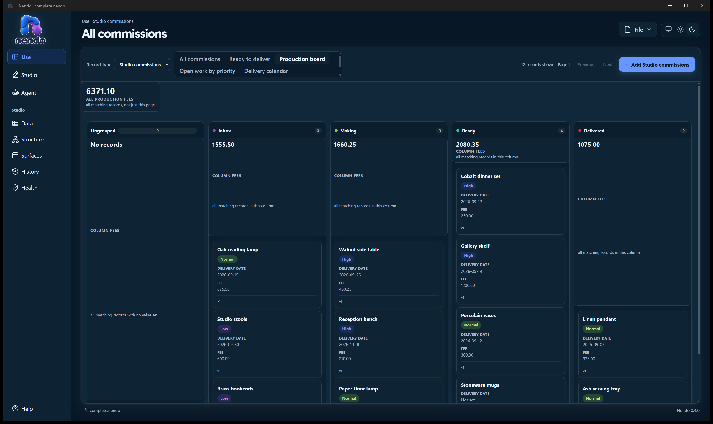

<p align="center">
  
</p>

# Nendo

**Malleable software in a single file.** One portable SQLite file starts empty
and is shaped — by people and by coding agents — into a working application:
schema, data, forms, boards, record pages and revision history. No generated
project. No build step. No regeneration when you want a change.

*Nendo* (粘土) is Japanese for clay.

> **Experimental.** Nendo is a research prototype exploring whether malleable
> software works, not a product. It runs as an unsigned per-user Windows x64
> install. Read [State](#state) before you rely on anything here.

**[thomasrohde.github.io/nendo](https://thomasrohde.github.io/nendo/)** — the
concept, how it works, how to use it, the honest status, and guides written for
people outside this repository. It does not render `docs/`.

<p align="center">
  
</p>

<p align="center"><sub>A board an agent authored over MCP, in the running host.
Captured from the 2026-09-12 review build (0.18.0 is current), with the rest of
that review in <a href="docs/reviews/README.md">docs/reviews/</a>.</sub></p>

The installed host always provides **Nendo Studio**, a high-quality database
explorer and editor. Custom surfaces add focused experiences on top, but never
become the only route to the data — if a surface breaks, the data is still
there, and still editable.

## How it works

```text
Create empty file
  → add or import schema and data
  → work in the default Studio table
  → ask an agent to create or reshape a form, board or record page
  → review the semantic diff
  → accept, observe, and compensate where the operation supports it
```

Agents connect over a local MCP interface. They never get SQL, a database path
or filesystem access — only typed semantic operations. Their changes are
validated on a physical clone and previewed as a readable diff; accepting
replays the exact validated operations against your file. Nothing an agent gets
wrong can reach your data before you say yes.

## Start here

- **[Vision](docs/vision.md)** — what malleable software means and what would
  falsify it
- **[Architecture](docs/architecture.md)** — the system as built
- **[Roadmap](docs/roadmap.md)** — what's next, and what is honestly not yet true
- **[Development planner](docs/dogfooding.md)** — how this project plans its own
  work in a Nendo file. That file is the author's own data and is not in a clone;
  the document describes the workflow and the agent handoff
- **[Decisions](docs/decisions/README.md)** — the ADRs, which are the
  architecture authority
- **[Contracts](docs/contracts/)** — behavioural detail: MCP interface, semantic
  surfaces, scalars, queries, CSV, relationships, reads and authority
- **[Glossary](docs/glossary.md)** — the vocabulary this repository uses precisely

## State

The MVP loop works end to end, delivered as a local unsigned per-user Windows
x64 install. Four reference applications falsify the hypothesis from different
shapes — Idea Garden, Decision Log, the Axiom Register and
[Nendo Station](docs/nendo-station.md) — and the last two were built from an empty
file through the MCP interface alone.

Public distribution, signing, ARM64, cloud sync and cross-platform support are
**not** qualified, and the independent human evaluation has not been run. The
[roadmap](docs/roadmap.md) states each gap plainly.

## Build

Windows x64 only. `Nendo.Engine` is `net10.0` and builds anywhere, but the Desktop
host is WinUI 3 with WebView2.

### Prerequisites

| Tool | Version | Install |
| --- | --- | --- |
| .NET SDK | Pinned in [`global.json`](global.json) | `winget install Microsoft.DotNet.SDK.10` |
| Node.js with npm | The `engines` range in `src/Nendo.Workbench/package.json` | `winget install OpenJS.NodeJS.LTS` |
| PowerShell 7 | `pwsh`; every script in `tools/` assumes it | `winget install Microsoft.PowerShell` |
| Git | Any current version | `winget install Git.Git` |
| WebView2 Evergreen runtime | Already present on Windows 11 | `winget install Microsoft.EdgeWebView2Runtime` |
| NSIS | Only to build the installer; `makensis` on `PATH` | `winget install NSIS.NSIS`, or the NuGet route below |

Open a new shell after installing so `PATH` picks the tools up.

Where Group Policy disables winget, or only an internal package mirror is an
approved source, NSIS is also published on NuGet as the portable package
`NSIS-Tool` (a third-party repackaging; its `makensis.exe` is not
Authenticode-signed, the package carries NuGet.org's repository signature).
Restore it through your mirror and put it on `PATH` for the build session only;
nothing is installed. The steps are in
[architecture.md](docs/architecture.md#nsis-without-winget). The Windows App
SDK is bundled into the build output (self-contained), so it needs no separate
runtime. `global.json` rolls forward to the latest feature band, so a newer
10.0 SDK that is already installed wins the pin.

### Build and run

```powershell
cd src/Nendo.Workbench; npm ci; npm run build; cd ../..
dotnet build Nendo.slnx
./artifacts/bin/Nendo.Desktop/debug_win-x64/Nendo.Desktop.exe
```

Do not skip the Workbench step. The Desktop project copies
`src/Nendo.Workbench/dist` into its output but does not build it, so
`dotnet build` on a fresh clone succeeds and produces a host with no interface
to show. All build output goes under `artifacts/`, which is git-ignored.

Started with no argument, the app opens without a file; create one from there.
Pass the path of a `.nendo` file to open it instead. The files in `workspace/`
are tracked demos: open a copy, not the original.

### Verify

```powershell
pwsh ./tools/Test-Repository.ps1    # fast invariant check
pwsh ./tools/Test-Production.ps1    # full gate; includes the above
```

`Test-Production.ps1` does the whole build itself (`npm ci`, Workbench type check,
tests and build, then .NET restore, build and tests), so on a fresh clone it is
also the one-command build. It takes about a minute once packages are restored.
Some Desktop tests open real windows and use the clipboard, so run the gate in
an unlocked, interactive desktop session. On a locked workstation or a headless
session those tests fail without any product defect.

Packaging, the installer and the native review lanes outside the gate are
documented in [architecture.md](docs/architecture.md#building-and-verifying).

## Connect an agent

While a file is open with Agent access on, Nendo listens on a loopback port
that the file keeps on this computer. The first file you switch access on for
keeps 41763, and each further file keeps the next free port. The address is the
whole client configuration — there is no credential to find or paste:

```text
claude mcp add --transport http nendo http://127.0.0.1:41763/mcp
codex mcp add nendo --url http://127.0.0.1:41763/mcp
```

Agent → Connect shows the address a file uses and copies either command.

The registrations checked into this repository (`.mcp.json` and
`.codex/config.toml`) point at port 41766. That is the port the author's planner
file keeps on their machine, not a default, so on a fresh machine they connect
to nothing. To use them, set **Port for this file** to 41766 in Agent →
Connect for the file you want an agent in this checkout to reach; otherwise
register the address that panel shows.

Anything running on this computer can connect at the chosen access level, so
leave access **Off** when no agent is working.

## For coding agents

Codex reads [AGENTS.md](AGENTS.md); [CLAUDE.md](CLAUDE.md) imports that same file
for Claude Code. Both use [Nendo Development](docs/dogfooding.md) as the primary
work planner through the repository's existing MCP registrations. Read the live
work item and its acceptance criteria before implementation, and record outcomes
and remaining work at handoff. Accepted ADRs retain architecture authority.

The planner file is the author's own data and is not in a clone. Without it there
is no live work item to read: follow the planner-unavailable rule in AGENTS.md,
work from the repository instructions and the task in hand, and do not create a
replacement planner.

A curated, pinned set of first-party .NET agent
skills is vendored under `.agents/skills/` — use the matching skill rather than
guessing current SDK, template, MSBuild or test behaviour.

## Repository layout

| Path | What is in it |
| --- | --- |
| `src/Nendo.Engine` | The typed core: storage, semantic operations, diff, behaviour. The only code that touches SQLite |
| `src/Nendo.Desktop` | The WinUI 3 host: window, native shell integration, serving custom views from the open file |
| `src/Nendo.Workbench` | The renderer — TypeScript and Vite, bundled into the Desktop output |
| `src/Nendo.LocalMcp` | The loopback MCP server: tools, resources, leases and access modes |
| `tests/` | MSTest suites for the Engine, the Desktop host and the MCP adapter |
| `tools/` | Build, packaging, gate and review scripts (PowerShell and Node) |
| `extensions/` | Source for the eight example custom-view packages; a file carries a package's code once it is imported |
| `fixtures/` | Reference-application seed data |
| `workspace/` | Tracked `.nendo` demo files |
| `docs/` | Vision, architecture, ADRs, contracts and reviews |
| `site/` | The public website ([ADR-0018](docs/decisions/0018-public-website-and-deployment-lane.md)) — Astro, outside the product boundary |

## Contributing and security

[CONTRIBUTING.md](CONTRIBUTING.md) has the loop, the gate to run and the house
rules. [SECURITY.md](SECURITY.md) states the trust boundary and how to report a
vulnerability.

## Brand

[Static mark](docs/assets/brand/nendo.png) · [Animated mark](docs/assets/brand/nendo.mp4)

## Licence

[MIT](LICENSE). Vendored third-party material retains its own notices and licences.
