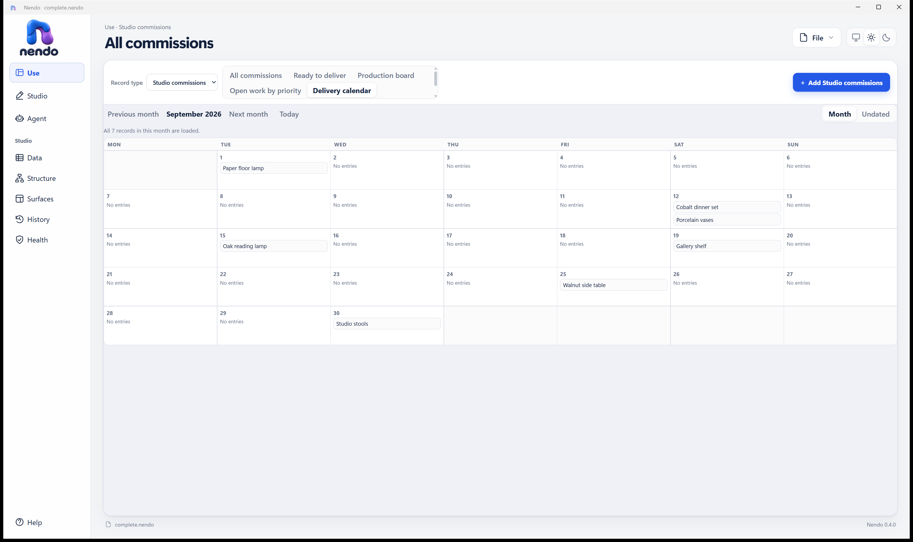
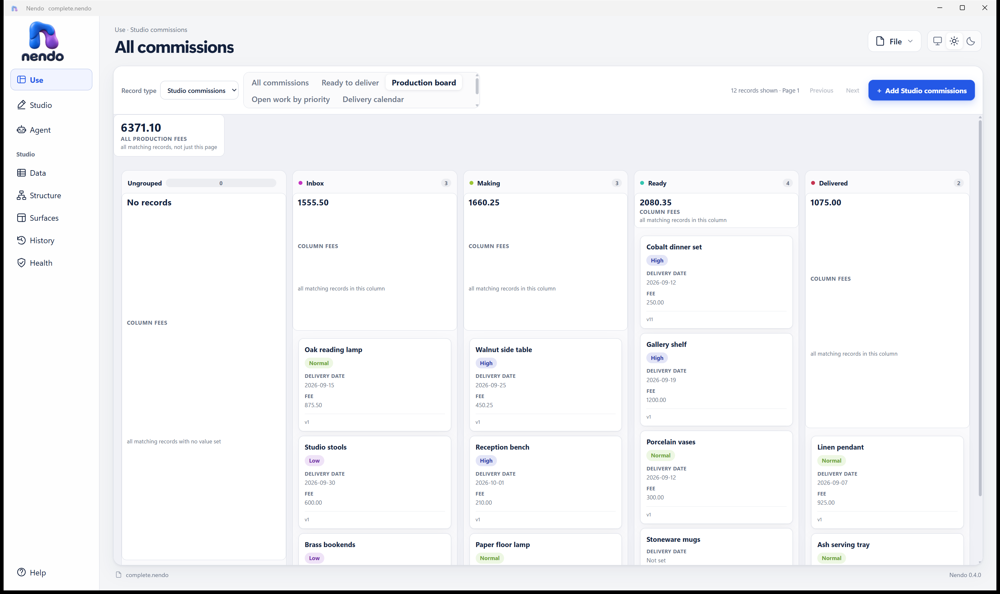

# Live Nendo MCP and widened vocabulary review — 2026-09-12

All **17 advertised MCP tools** and **12 resource routes** were exercised against the installed Nendo host and its open `complete.nendo` file. The widened vocabulary produced working lists, boards, calendars, summaries, tabs, related records and commands. The findings from this run are retained below with their follow-up resolutions; this is not a blanket pass for every feature combination.

The file began empty. After the owner accepted **Studio commissions — widened vocabulary demo** in Nendo, MCP observed the promoted definition and populated the demonstration. Native acceptance was performed by the owner, not automated by the test client. The final file contains:

| Record type | Semantic ID | Records |
| --- | --- | ---: |
| Studio clients | `vr_client` | 3 |
| Studio commissions | `vr_job` | 12 |

There are 15 fields, 78 UI nodes and 12 surface/command roots. Minimum host version is now **1.16.0**. The test checkpoint returned definition revision **9**, data revision **14**, change sequence **23**, no pending proposals and no active lease. Temporary test records were deleted; the useful demonstration remains. A later read after returning to the calendar observed data revision 15 / sequence 24, with the same counts and no lease or proposals; the visible Cobalt dinner set date was then September 19. The assertions and screenshots below describe the sequence-23 test checkpoint. This subsequent change was not made by an MCP test mutation.

## See the new vocabulary in action

In **Use → Studio commissions**, try these views:

| View / feature | Observed result |
| --- | --- |
| All commissions | 12 records; fee sum `6371.10`, minimum `80`, maximum `1200` |
| Ready to deliver | Equality filter selects 4 records; sum `2080.35` |
| Production board | Stage grouping: Inbox 3 / `1555.50`; Making 3 / `1660.25`; Ready 4 / `2080.35`; Delivered 2 / `1075`; empty Ungrouped column |
| Open work by priority | Excludes Delivered: 10 records; High 4 / `2110.25`, Normal 3 / `2175.50`, Low 2 / `680`, Ungrouped 1 / `330.35` |
| Delivery calendar | September has 7 dated commissions after excluding Delivered; two records appear on September 12; Undated contains Brass bookends and Stoneware mugs |
| All delivery dates | September has 8 dated records, including the delivered Linen pendant; October has Reception bench on October 1 |
| Commission details | Overview, Money and Schedule tabs render different fields. An unsaved title draft survived a tab round trip; it was reverted without saving |
| Mark ready / Reopen for today | Commands changed stage, Boolean, UTC date-time, civil date and null values. Three field operations advanced record versions by three each |
| Studio clients → Atelier North | Related list contains four commissions; related fee sum `960.35` |



Light and Dark were both inspected on the running app. These are native-window captures, not mockups: [dark calendar](2026-09-12-mcp-vocabulary/calendar-dark.png), [all commissions](2026-09-12-mcp-vocabulary/all-commissions-light.png), [filtered list](2026-09-12-mcp-vocabulary/ready-light.png), [priority board](2026-09-12-mcp-vocabulary/priority-board-dark.png), [all dates](2026-09-12-mcp-vocabulary/all-dates-light.png), [October](2026-09-12-mcp-vocabulary/october-light.png), [retained unsaved draft](2026-09-12-mcp-vocabulary/tab-draft-retained-dark.png), [Schedule tab](2026-09-12-mcp-vocabulary/tabs-schedule-light.png), [related records](2026-09-12-mcp-vocabulary/client-related-light.png).

The [definition fixture](2026-09-12-mcp-vocabulary/fixture.json) contains the authored proposal operations, not credentials or authority handles. It is a reference for reproducing the vocabulary composition in an empty file, not an instruction to replay against this populated file.

## Connection and coverage

One live discovery entry was found under `%LOCALAPPDATA%\Nendo\Mcp\active`. Its owning process was `Nendo.Desktop`, PID `29536`, from `%LOCALAPPDATA%\Programs\Nendo\Nendo.Desktop.exe`. The loopback listener at `127.0.0.1:41763` belonged to that process. Discovery and `server/discover` agreed on protocol **2026-07-28**; the server reported version `0.4.0` and authoring mode.

Task-local HTTP clients read the bearer directly from discovery into process memory and used the advertised routing headers and request metadata. No bearer was printed or placed in a new configuration. This exercises authenticated MCP wire requests through the repository's client helper, **not native Codex MCP-client registration**. That separate lane requires a compatible client and secure task-local credential injection. The protocol uses no initialize handshake or session header.

| Tool family | Successfully called tools | Additional checks |
| --- | --- | --- |
| Lease | `acquire`, `renew`, `release`, `status` | Owner identity, wrong handle refused, released handle refused, final lease absent |
| Data | `create_record`, `create_records`, `set_field`, `delete_record`, `execute_command`, `get_receipt` | Exact retries, changed-payload key reuse refused, stale versions refused, transactional batch rollback, receipt recovery after release |
| Change set | `begin`, `add_operations`, `amend`, `validate`, `preview`, `reject` | Valid and invalid definitions, amendment to valid calendar, native owner acceptance observed over MCP, all later drafts rejected |
| Health | `verify_integrity` | Post-write scan returned `rescanned: true`, integrity `ok` at sequence 23; unchanged repeat returned `rescanned: false` |

Names above use the `nendo.<family>.` prefix. A recursive check of successful tool responses found no required-property, type or enum mismatches against advertised output schemas. This was a limited schema check, not a complete JSON Schema validator.

All eight fixed resources were read: describe, manifest, entities, surfaces, vocabulary, examples, proposals and health. All four templates were read with valid parameters: entity schema, entity records, history and revision operations. Records paged at limit 3 without loss or duplication; a real record cursor became stale after a write. History paged at limit 3 and proposal operations at limit 10. The accepted definition expanded **101 submitted operations into 247 canonical operations across nine mutation revisions**; returned operation counts matched the paged totals.

The initial read-only pass also checked missing/invalid authentication (`401`), invalid page limits (`0`, `101`), tampered cursors and unknown resources. The subsequent authorized mutation pass checked real stale cursors rather than treating malformed-cursor rejection as equivalent.

## Data and authoring boundaries

All eight storage kinds were used: text, long text, integer, decimal, Boolean, date, date-time and UUID. References and scalar single-choice metadata were also exercised. Exact-number readback preserved decimal `0.1234567890123456789012345678` and signed Int64 extrema `9223372036854775807` / `-9223372036854775808` through numeric envelopes and returned numeric lexemes.

Rejected inputs left the active sequence unchanged: Int64 overflow, fractional integer, malformed numeric envelope, February 30, date-time without a zone, malformed UUID, string Boolean, unknown choice, scalar array and stale reference-target version. Deletion of a referenced temporary client was refused, then succeeded after its referencing temporary commission was deleted. A batch containing a valid row followed by an invalid choice left neither row behind. Empty and 51-record batches were refused.

Create, batch create, set, command and delete retries returned their existing outcomes. Reusing an idempotency key for changed input was refused. Receipt recovery after lease release returned the original committed revision without restoring write authority; an unknown key returned an unresolved/null receipt.

New vocabulary validation rejected each intentionally invalid draft:

| Invalid definition | Diagnostic |
| --- | --- |
| Group-scoped summary on a list | `NUI297` |
| Unknown summary scope | `NUI296` |
| Empty tab group | `NUI310` |
| Nested tab group | `NUI311` |
| Calendar with seven declared filters plus two date bounds | `NUI300` |
| Ninth record-list root | `NUI153` |
| Calendar bound to a date-time field | `NUI321` |

Each draft was rejected afterward, with no active-file change. Schema rename, required-field changes, retire/backfill and UI property/move/remove operations received successful isolated previews. Canonical create, set and delete each previewed independently; their dependent composition exposed the finding below. Legacy conversion was tested only as a refusal on an ordinary text field; a successful conversion of an actual unbound legacy reference was **not** exercised.

## Findings and resolutions

### Closed P2 — Board summaries stretched and displaced cards

Both themes show disproportionately tall group-summary tiles, with cards beginning at different vertical positions. The empty Ungrouped column is particularly conspicuous. Totals are correct; layout is not.



[Same board in Dark](2026-09-12-mcp-vocabulary/production-board-dark.png). Reproduce by opening Production board with the retained fixture. `src/Nendo.Workbench/src/styles.css` gives `.board-column` the rows `auto minmax(0, 1fr)`; the summary now occupies the expanding second row. This is a likely layout cause, not a tested source fix.

Acceptance: summaries remain compact regardless of group cardinality, cards start consistently, and an empty column does not become a giant summary tile in either theme.

Closed in `7f92bbb`. Board headers and summaries now size to their content, all five summary rows measured the same height in both themes, and the cards start on one line. The follow-up captures and measurements are in [the UI polish review](2026-09-12-ui-polish.md).

### Closed P2 — Selected view identity was misleading, and the sixth view became hidden

The page heading remains **All commissions** while Ready to deliver, boards or calendars are selected. All delivery dates is initially below a small internal scroll area in the view switcher despite substantial unused horizontal space. Keyboard focus can reveal it; selecting it rerenders the switcher and hides the active button again. The stale heading then provides no reliable replacement indication.

Reproduce by selecting Production board or Delivery calendar; for the overflow case, focus the next view after Delivery calendar and select All delivery dates. Compare the calendar captures above. `main.ts` updates the chrome using `surfaceTitle(current!)`; selection and chrome identity need to agree.

Acceptance: the heading names the selected view, and its selected switcher control remains visible after selection and rerender.

Closed in `7f92bbb`. A disclosure picker keeps the selected view visible, exposes all six views with their kinds, and updates the page heading. Escape, focus restoration, same-view dismissal and the 960-pixel viewport passed in the [UI polish review](2026-09-12-ui-polish.md).

### Closed P2 — Proposal create-then-edit could not resolve its provisional record

A proposal containing canonical `data.createRecord` alone validates as previewable. Editing an existing record with `data.setField` also validates. Combining creation and editing of the newly created record fails validation with:

```text
NENDO_RECORD_NOT_FOUND: The semantic precondition was not met.
```

Minimal ordered operations on the existing `vr_job` type:

```json
[
  {"operationType":"data.createRecord","payload":{"entityId":"vr_job","recordId":"vr_previewNew","values":{"vr_title":"Preview only"}}},
  {"operationType":"data.setField","payload":{"entityId":"vr_job","recordId":"vr_previewNew","fieldId":"vr_title","expectedRecordVersion":1,"value":"Edited preview"}}
]
```

Submit these operations using the advertised change-set mutation envelope. Failure occurred both within one mutation and across two successive mutations. An earlier larger composition returned the less specific `NENDO_INVALID_REQUEST`; isolated cases established the missing-record failure. All these proposals were rejected, so no provisional row entered the active data.

Acceptance: ordered authoring can resolve records created earlier in the proposal, or the public authoring contract explicitly declares this composition unsupported and validation returns an actionable diagnostic. At review time, no source fix was attempted.

Closed after this review. Staleness capture now excludes records created by the same change set because they have no active-file version to capture. The physical clone and promotion still replay operations in order and enforce the expected record version. `ProposalCanCreateThenEditItsOwnRecordInOrder` exercises the behavior through MCP: the proposal is previewable, the active record is absent before acceptance, and promotion creates version 2 carrying the edited value.

### Closed P2 — Health resource recommended a nonexistent tool

The health resource description says to call `nendo.application.verify_integrity`. The catalog exposes `nendo.health.verify_integrity`. Following the resource advice returned `NENDO_TOOL_UNAVAILABLE`; calling the advertised tool succeeded. The stale reference also exists in `src/Nendo.LocalMcp/NendoMcpResources.cs` and `NendoMcpContracts.cs`.

Acceptance: resource guidance names the advertised health tool and catalog consistency prevents this mismatch.

Closed after this review. Both resource guidance and the health contract type now name `nendo.health.verify_integrity`. `TheOperationSpecificationIsAResourceAndTheDescriptionPointsAtIt` checks that the named tool exists and that the obsolete name is absent.

### Closed P3 — Contract and migration guidance lagged behavior

`docs/contracts/mcp-interface.md` says seventeen tools but lists sixteen, omitting `nendo.data.delete_record`. It also says “Sixty-second expiry” although the current default is no expiry, as described by the accepted ADR-0009 amendment. Delete and lease lifecycle worked in this run; these are documentation discrepancies.

The vocabulary's legacy-conversion summary describes converting stored text to references without exposing the narrower legacy-field precondition. An ordinary text field was refused with `NPROP002: Only an unbound legacy reference field can be converted.` The relationships contract contains the dedicated migration requirements; discovery guidance should expose or link them so an agent does not infer ordinary text conversion support.

Closed after this review. The MCP contract now lists all seventeen tools, documents no-expiry as the default with optional bounded expiry, and states the ordered create-then-edit rule. The live vocabulary now says legacy conversion accepts an unbound legacy Reference field and does not convert an ordinary text field; its contract test asserts both phrases.

## Execution evidence and limits

Task-local commands ran against the installed app:

| Command under `artifacts/mcp-vocabulary-review/` | Literal exit / outcome |
| --- | --- |
| `node prepare.mjs` | 0; proposal preview, owner acceptance observed, lease released |
| `node data-tests.mjs` | 1; data tests and cleanup completed, then a harness assertion incorrectly expected the nine-mutation promotion to be one large history revision |
| `node remaining-tests.mjs` | 1; seven vocabulary guards passed, mixed canonical authoring validation refused; drafts and lease cleaned up |
| `node complete-tests.mjs` | 1; reduced mixed authoring proposal still refused; cleanup completed |
| `node postflight.mjs` | 0; correct nine-revision/247-operation history accounting, receipt recovery, integrity and final data counts |
| `node isolate-canonical.mjs` | 0; isolated positive previews and expected refusal observations |
| `node canonical-data-isolation.mjs` | 0; narrowed create-then-set reproduction and positive resource/schema reads |
| `node final-state.mjs` | 0; 3 clients, 12 commissions, sequence 23, no lease or pending proposal |

Exit 0 for an isolation probe means its expected observations completed, not that the product defect passed. Earlier harness failures are not hidden or counted as server failures. Scratch scripts and response logs are disposable; this review and its selected illustrations are the deliverable, not a reusable test suite.

Native-window capture and targeted messages to Nendo's own WebView child exercised the visible views, themes, tabs and draft retention. No desktop-wide input or database access was used. The native Studio route remained reachable. Stored Brass bookends still had its original title and version 1 after the unsaved-draft check.

Repository gate: `pwsh ./tools/Test-Repository.ps1` — exit 0, literal final output `Repository verification passed.` Restore, build, .NET tests, production gate, packaging and installer lanes were not run: no product source was changed or app rebuilt. Restart/crash recovery, accessibility, hardened lease expiry, multi-client contention, exhaustive filter/operator combinations and successful legacy migration remain outside this run. Native Codex MCP-client integration remains a separate lane from these direct protocol requests.

## Follow-up implementation evidence

The finding-resolution change ran these source-level checks:

- Focused MCP regressions: **Passed 2, Failed 0, Skipped 0**. This covered ordered create-then-edit and health/vocabulary catalog consistency.
- Complete `Nendo.LocalMcp.Tests`: **Passed 82, Failed 0, Skipped 0**.
- `pwsh ./tools/Test-Production.ps1`: **exit 0**. Workbench passed 57 tests; Engine passed 456, Local MCP passed 82 and Desktop passed 139. Production boundaries and the included repository gate passed.
- The published app was opened on a task-owned copy of `complete.nendo` and driven through its authenticated Streamable HTTP endpoint. MCP 2026-07-28 advertised 17 tools; health guidance named `nendo.health.verify_integrity`; the vocabulary limited legacy conversion to an unbound legacy Reference field; and a two-mutation create-then-edit proposal reached `previewable`. The active copy's revisions did not move, the proposal was rejected, the lease was released and Agent access was turned off.
- `Publish-NendoPayload.ps1` and `Build-NendoInstaller.ps1` produced version 0.4.0 build `bb626e00b1336159`. `Test-NendoSetupIsolated.ps1` passed first install, in-place upgrade and uninstall against a task-owned root for all 675 payload files. `Test-NendoInstaller.ps1` stopped at its expected safety interlock because this Windows user has an owner installation; the NSIS bootstrapper, registry and shortcut lane therefore remains a clean-user check.
- `Nendo-Setup.exe /S /KEEPLEGACYPILOTS` upgraded the owner installation, and all 675 installed files matched the publish manifest. The installed app then reopened `complete.nendo` as `Nendo — complete.nendo`.

The original execution evidence above remains the record of the 2026-09-12 black-box run. Follow-up test and packaging results describe the corrected build and do not retroactively relabel the observed failures as passes.
