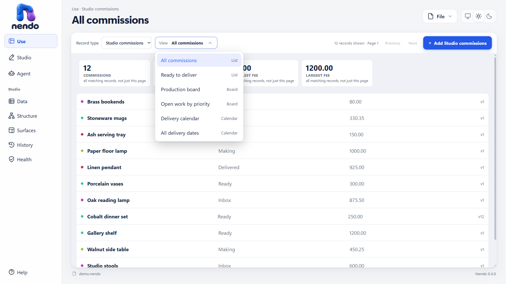
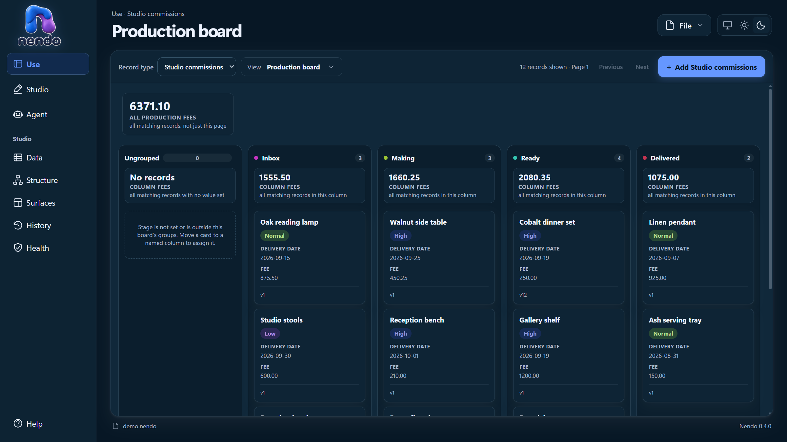
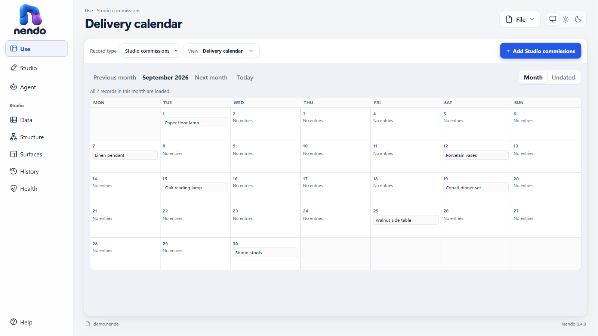
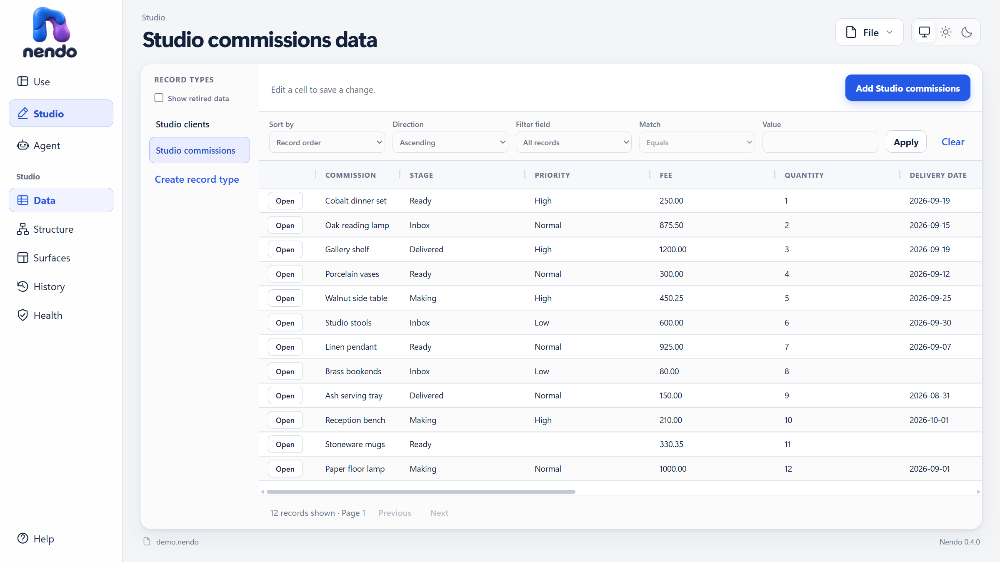
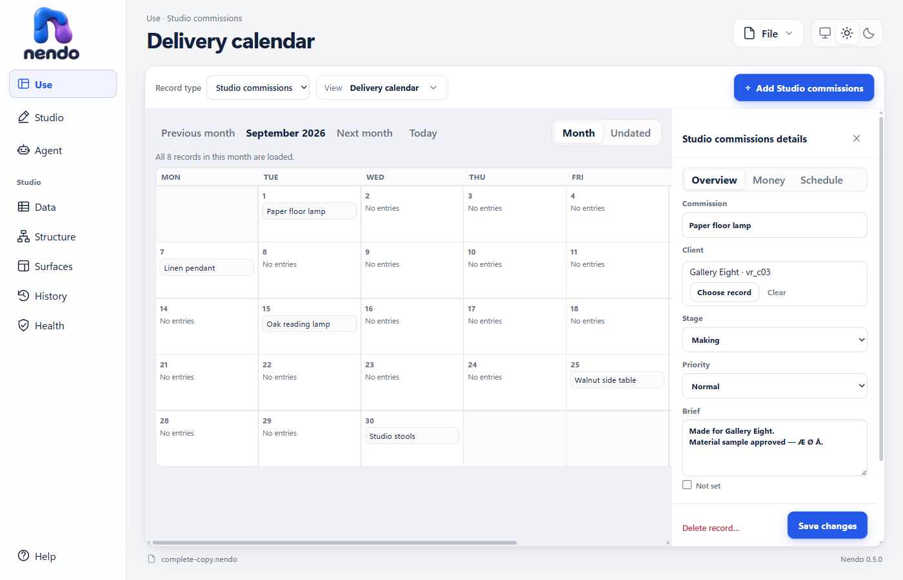
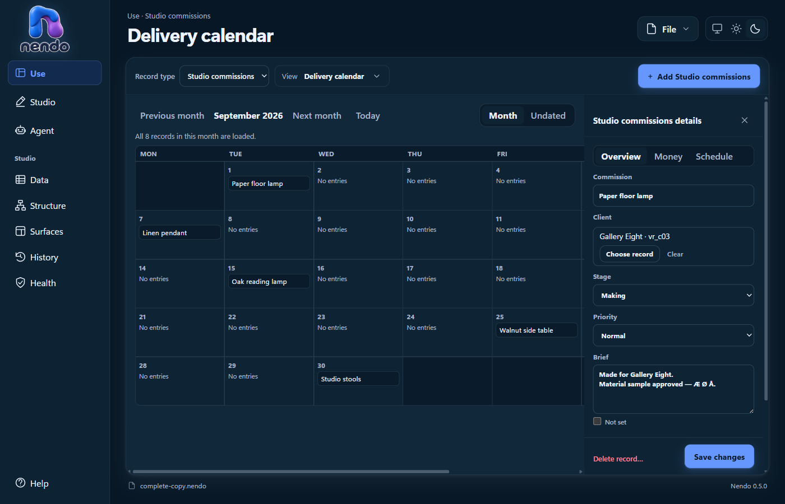

# View picker and board spacing — 2026-09-12

Replaced the scrolling view-button cluster with a disclosure picker that keeps the selected view visible and lists all views with their kind. The page heading follows the selected surface. The picker uses Nendo's existing SVG chevron, centered and reversed while open; Escape closes it, selecting the current view closes it, and selection returns focus to the summary through asynchronous calendar refreshes.

Surface totals now have 20px of space below the toolbar and a 24px horizontal inset. Board columns use a vertical flex layout: headers and summaries keep their natural height, and the card area receives the remaining space.

## Checks

The published Windows app opened a task-owned copy of the commissions demo. Its actual WebView was exercised through a local diagnostic connection. Light and Dark were inspected at desktop width; the picker was also checked at a 960 CSS-pixel viewport. All six surfaces remained available, including the previously hidden sixth calendar. Heading changes, Escape, same-view dismissal, SVG presence and focus return after asynchronous calendar loading passed. At 1600 CSS pixels, all five board headers measured 46px and their summaries measured 71px; all card areas began at the same Y coordinate, in both themes.

- `pwsh ./tools/Publish-NendoPayload.ps1`: exit 0, `Published pilot`. Includes Workbench restore, TypeScript check, 57/57 existing Workbench tests, Vite build and Windows x64 publish.
- `pwsh ./tools/Build-NendoInstaller.ps1`: exit 0, `Built Nendo installer`.
- `pwsh ./tools/Test-Repository.ps1`: exit 0, `Repository verification passed.`
- `git diff --check`: exit 0.
- `pwsh ./tools/Test-NendoInstaller.ps1`: ownership interlock refused the install/uninstall smoke because the owner installation exists. The clean-user install/uninstall wrapper lane was not run.
- `pwsh ./tools/Test-NendoSetupIsolated.ps1`: exit 0, `Isolated setup smoke passed`; the staged payload was pruned.

No .NET test suite or full production gate was run for this TypeScript/CSS-only behavior change. No file schema, stored definition or records were edited. The earlier MCP review remains a historical record; its board-layout and selected-view-identity findings are addressed by this follow-up, while its other findings are outside this UI task.

Owner upgrade: `Nendo-Setup.exe /S /KEEPLEGACYPILOTS` exited 0. All 675 installed payload files matched the publish manifest. The installed app reopened the original complete.nendo; the task-owned preview copy and diagnostic profile were removed.

## Follow-up aesthetic pass

The calendar toolbar, status line, dated grid and undated records now share a 16px inset. Studio's Open action is a 28px outlined button centered in its own grid cell. Surface totals align with the records beneath them, the Ungrouped board count no longer stretches, month navigation can wrap, and the one-record calendar status uses singular grammar.

The published app was inspected with a task-owned copy of the current commissions file: calendar and Data in both themes, lists, boards, record details and Structure, plus the calendar at 960 CSS pixels. Calendar left/right insets measured 16px; the first five Open buttons were within 0.1px of their cell centers and clicking Open reached the correct record editor. All five board count badges measured 20.64px wide; summary and record left edges matched exactly. No records were edited during the checks.

[Narrow calendar in Dark](2026-09-12-ui-polish/calendar-narrow-dark.png). On a narrow view the calendar preserves its seven day columns with horizontal scrolling where needed. Record details and Structure were inspected without further visual changes.

The follow-up `Publish-NendoPayload.ps1` and `Build-NendoInstaller.ps1` each exited 0. The publish included 57/57 Workbench tests, TypeScript checking and the Windows x64 build. `Test-Repository.ps1` and `git diff --check` passed. Full .NET/production testing remains outside this presentation-only change.

The follow-up isolated setup test exited 0 (`Isolated setup smoke passed`). The installer smoke again stopped at its existing-installation interlock; it did not uninstall the owner's app. Task-owned visual-check files and browser profile were removed after retaining the selected screenshots above.

The follow-up owner upgrade exited 0; all 675 installed payload files matched the new manifest. The installed app reopened the original `complete.nendo`.

## Stable calendar columns while inspecting a record

Opening a calendar entry keeps the month grid at the width it had before the
side inspector appeared. The calendar surface becomes horizontally scrollable
by the inspector width, so the day columns no longer narrow or move beneath the
pointer. The compact layout is unchanged because its inspector already overlays
the calendar.

The real debug Desktop opened a task-owned copy of `complete.nendo` at a 1400 by
900 CSS-pixel viewport. In both Light and Dark, the measured day cell remained
158.1875px wide and the month grid had a 0px width delta after opening an entry.
The surface gained 330px of horizontal overflow, exactly matching the inspector,
and the WebView reported no page errors. No record was edited.

`pwsh ./tools/Test-Production.ps1` passed: 57 Workbench tests, 456 Engine tests,
82 Local MCP tests and 139 Desktop tests, followed by the production-boundary
and repository gates. The direct Workbench TypeScript check and 57-test suite
also passed. The first direct `npm` invocation found this machine's stale roaming
shim; running the installed Node/npm entry point completed both checks.
