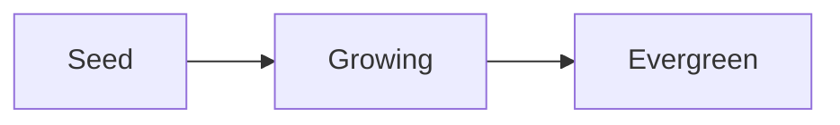

# Write, link and tag

A note is Markdown. Most of it is ordinary writing; three small marks make it part of the garden.

## What you write becomes records

| Write | When you save it becomes |
| --- | --- |
| `[[start-here]]` or `[[Start here]]` | A **Link** to the note with that slug or title, carrying the line it sits in. That note now lists this one among its backlinks. |
| `[[A new idea]]` | A link, and a new **Seed** note called A new idea, planted in the same step. |
| `#reading` | A **Tag**, made once for the whole garden, and this note filed under it. |
| `- [ ] Call Sam` | A **Task** that knows its note. Tick it and save, and the same task is marked done. |
| Anything inside code | Nothing. Between backticks or in a fenced block, brackets and hashes stay text. |

To show other words for a link, put them after a bar: `[[start-here|the welcome note]]` reads as *the welcome note* and still links to Start here.

> Remove a link from the text and save: the Link goes. The note it pointed at stays, because a note is never deleted by a save.

## Linking without looking things up

Type `[[` in the editor and a list of notes opens. Keep typing to narrow it, move with `↑` and `↓`, and press `Enter` or `Tab` to put the note's slug in. A slug is a note's short name, unique in the garden, so a link always means one note.

## View and Edit

A note opens for **reading**: the page, with its title as a heading. **Edit** (`Ctrl` `E`) swaps it for its Markdown with a live preview beside it. Drag the line between them to give either more room; drag it to the right edge to fold the preview away.

## Everyday Markdown

`# Heading`, `**bold**`, `*italic*`, `> quote`, bulleted and numbered lists, `---` for a rule, and fenced code with three backticks. Tables, footnotes and images are not drawn in a note.

## Diagrams

A fence whose language is `mermaid` is drawn as a diagram, in the page and in the preview:

~~~text

~~~

Flowcharts, sequence diagrams, class and state diagrams, timelines and the rest of [Mermaid](https://mermaid.js.org/intro/) are drawn in the garden's colours, and follow Light and Dark. While you type, a diagram is drawn again when you pause. One that Mermaid cannot read keeps its text, with the reason under it. Links and tags inside a diagram are text, as in any fence.

## Written by hand

Links, tags and tasks can also be made by hand, a task with **Add Task** and a link on a note's page, or by an agent. Those are marked **Manual**, may say more than a body can (a link that *Supports*, *Contradicts*, is *See also* or *Part of* another note), and a save never touches them.

## Your drafts are safe

Move to another note with unsaved changes and the draft is kept: the tree marks the note with a dot until you save it. A new note you have not saved yet waits at the top of the tree, in italics, so pressing **New note** again or **Today** never writes over it; click it to carry on. Clicking the note you are writing, or a link to it, keeps what you have written too.

Drafts are also kept on this device if you leave the view or close Nendo, and come back when you return. The device keeps the newest fifty or so. If it cannot keep one, a line above the note says which, with a link to each, so you can open it and save it before you close Garden.

If somebody changes the note's text elsewhere while you write, the line under the toolbar says so: **Keep mine** saves yours over the change, **Discard mine** lets yours go and shows the note as it is now. A change that leaves the text alone, such as a new stage, does not stop you.

If Nendo never answers whether a save was kept, **Save** again finishes it, even after Garden has closed and opened again: the note is kept once.
